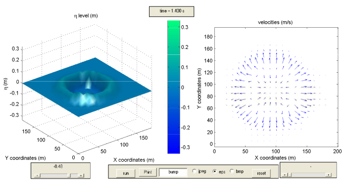
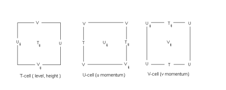
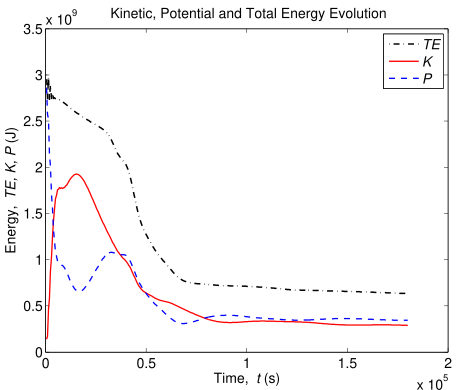
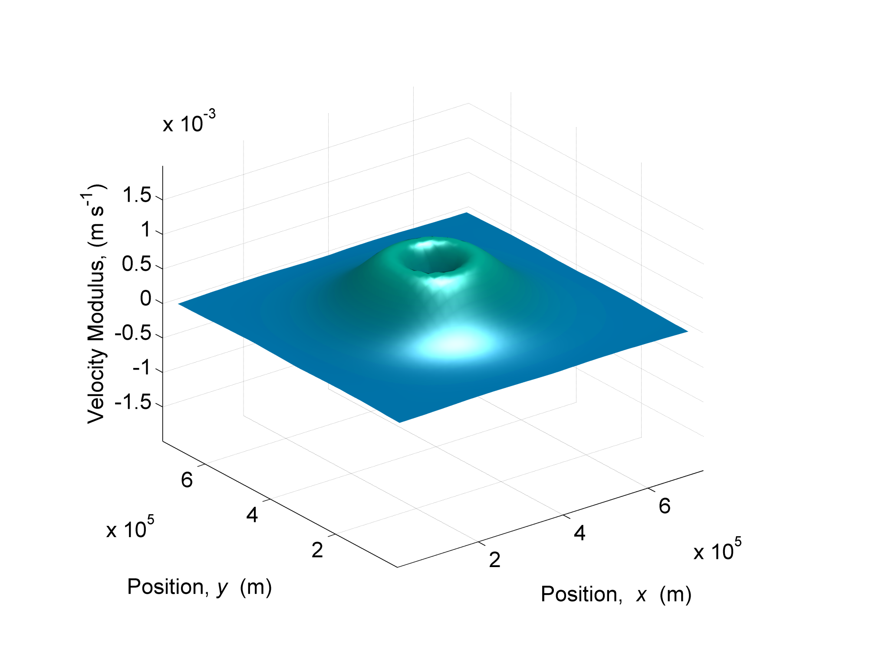

# SHEL - SHallow-waters numerical modEL

<div align="center">
  
  <p><em>Simulation of water elevation propagation in a shallow water domain</em></p>
</div>

## What is SHEL?

The SHEL (SHallow-waters numerical modEL) is a finite volume, free-surface, variable bottom, shallow-waters equations numerical solver.

The SHEL is coded in Matlab with a built-in graphical interface for loading, editing and saving of simulation parameters and forcings and also for running, visualizing and exporting images (eps, png) and movies (avi).

<div align="center">
  
  <p><em>SHEL uses the Arakawa C-grid staggered mesh system for numerical stability</em></p>
</div>

The code is compact, efficient and extensible, meaning that developers can easily replace the core solver files with custom numerical schemes and can even contribute to the stack of available numerical schemes.

The SHEL, by default, uses an Arakawa C grid type over a land-mask with a second-order accurate in time and space leapfrog and central differences schemes for the momentum equations and a first-order accurate upwind scheme for the tracer equation. Dirichelet, Neumann and Sommerfeld type conditions were implemented as boundary conditions. It is fairly easy to replace these numerical methods with others.

## Repository Structure

The repository is organized as follows:

- `src/matlab/`: Contains all the Matlab source code
  - `run.m`: The main entry point for running the model
  - `data/`: Input data and simulation results
  - `gui/`: Graphical user interface components
  - `model/`: Core implementation of the numerical model
- `docs/`: Documentation
  - `latex/`: Original LaTeX documentation and figures
  - `markdown/`: Converted markdown documentation
- `COPYING`: License information

## Documentation

Comprehensive documentation is available in the [docs/markdown](docs/markdown) directory, including:
- [Abstract and Keywords](docs/markdown/swe-abstract.md)
- [Part 1: Model Fundamentals](docs/markdown/swe-part1.md)
- [Part 2: Model Implementation](docs/markdown/swe-part2.md)
- [Part 3: Validation and Results](docs/markdown/swe-part3.md)
- [Conclusions and References](docs/markdown/swe-references.md)

<div align="center">
  
  <p><em>SHEL tracks energy conservation during simulations, showing kinetic, potential, and total energy</em></p>
</div>

## How to Use SHEL

1. Open Matlab
2. Set the workfolder to the `src/matlab` directory of the SHEL repository
3. Type `run` and press enter

## How to Cite

If you use SHEL in your work, please cite the scientific documentation as follows:

```
Riflet, G., 2010. SHEL, a Shallow-Water Numerical 
Model: Scientific Documentation. Instituto Superior Técnico, 
Universidade Técnica de Lisboa.
```

## Contact Information

- Email: guillaume.riflet at gmail.com
- Website: http://code.google.com/p/shel/
- Last Updated: 2010-08-19

<div align="center">
  
  <p><em>Visualization of velocity field showing the influence of Coriolis force on ocean currents</em></p>
</div>
