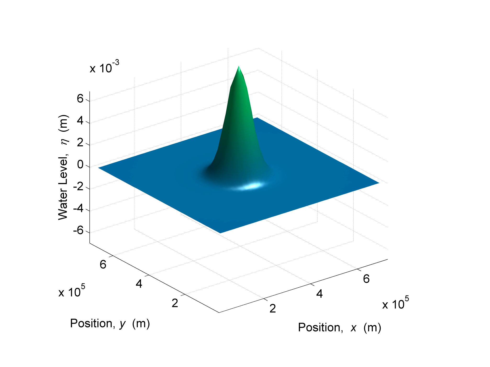
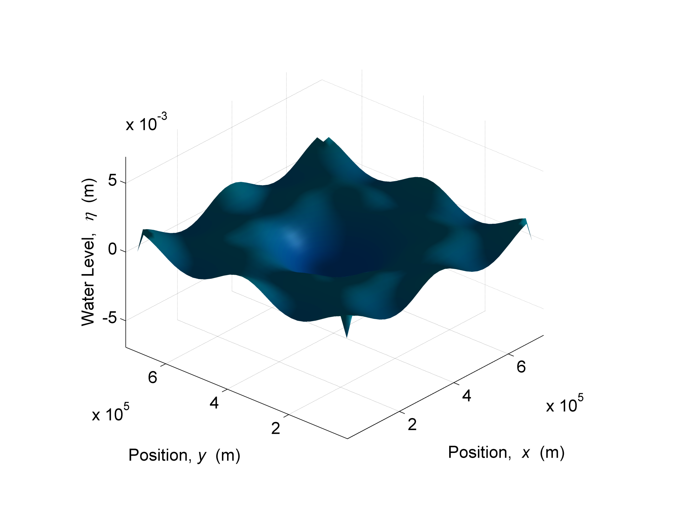
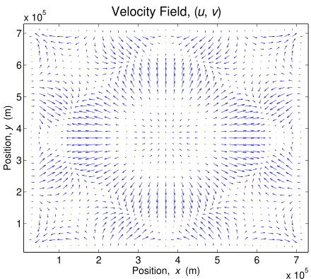
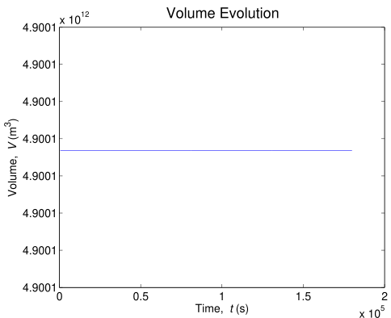
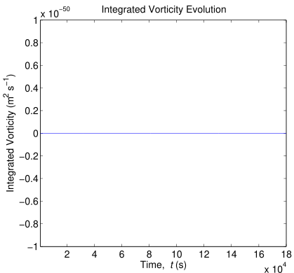
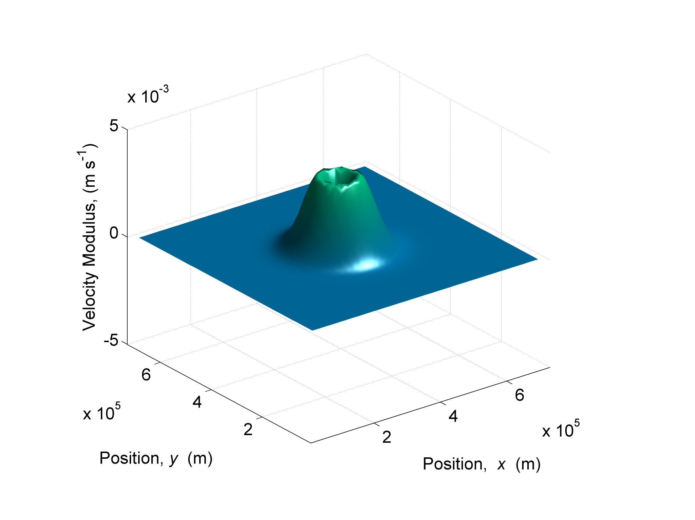
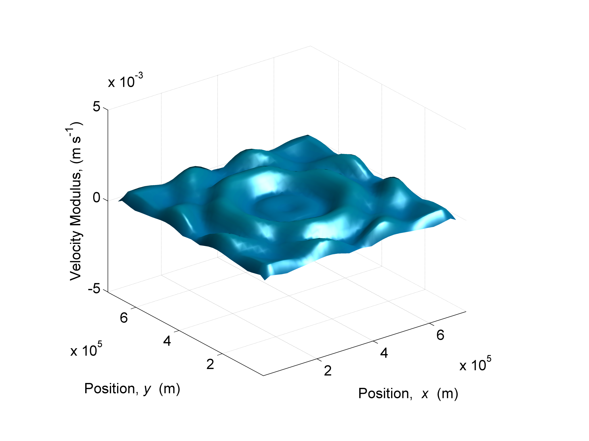
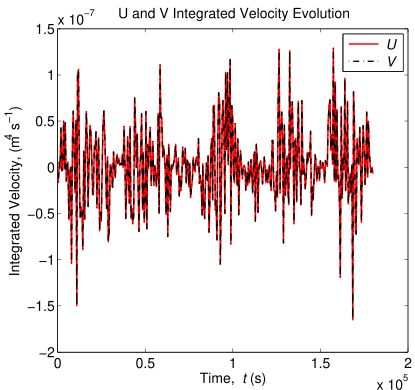
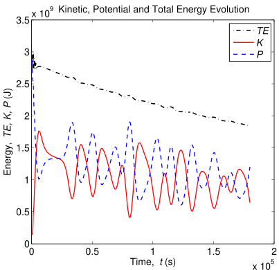

# SHEL Model Validation

[◀ Back to Table of Contents](README.md)

## Validation

The interest of a gaussian level initial condition is that one can test adjustment under gravity of a non-rotating fluid under the hydrostatic approximation, much like the exercise on Gill (1982, p. 110). The hydrostatic approximation simply neglects the vertical velocity and acceleration of the particles to calculate the local pressure. Later on, the Coriolis acceleration can be added, and the flow adjustment under gravity of a rotating fluid can take place, again, much like the exercise on Gill (1982, p. 199). Some basic simulations are set to test the conservation of volume, momentum and vorticity. Even though energy should be conserved when considering the Euler equations, in practice, the numerical viscosity in the model ensures the maintenance of a good rate of dissipation of energy. The interesting thing to test then, is to estimate the rate of energy dissipation.

### Gaussian Bell-Shaped Geometry

The other interesting aspect of the gaussian level initial condition, is that its volume is easily integrable, and its initial potential energy is also easily integrable. Indeed, the gaussian water elevation is given by expression:

$$\eta_{\sigma_x\,\sigma_y} (x,y) = \frac{V}{\sigma_{x}\sigma_{y} \pi }e^{-(\frac{ (x-x_0)^2}{\sigma_{x}^2} + \frac{ (y-y_0)^2 }{ \sigma_{y}^2 })}$$

where $\sigma_x$, $\sigma_y$ is the gaussian bell width along the $x$-axis and the $y$-axis, $x_0$, $y_0$ are the coordinates of the gaussian bell centre. The integral of this equation over an infinite domain is classical and yields exactly $V$:

$$\int \eta_{\sigma_x\,\sigma_y} \, dx\,dy = V.$$

Another way of writing the equation in terms of the gaussian bell-shaped surface height, $h_0 \equiv \eta_{\sigma_x\,\sigma_y}(x_0,\,y_0)$, is:

$$\eta_{\sigma_x\,\sigma_y} (x,y) = h_0 \, e^{-(\frac{ (x-x_0)^2}{\sigma_{x}^2} \,+\, \frac{ (y-y_0)^2 }{ \sigma_{y}^2 })}$$

which makes:

$$V = \pi \, \sigma_x \, \sigma_y \, h_0.$$

This equation is quite plausible since when considering $\sigma_x = \sigma_y$, the volume $V$ is equivalent to that of a cylinder of radius $\sigma$ and height $h_0$.

However, to make things further interesting, integrating the square of the gaussian bell-shaped surface would lead in determining the initial total energy of the system. Thus, a general relationship between power orders of $\eta_{\sigma_x,\,\sigma_y}$ would be mighty useful. In fact, it can be easily deduced as follows, for the volume:

$$\begin{align}
V_{\frac{\sigma_x}{\sqrt{n}},\,\frac{\sigma_y}{\sqrt{n}}} &= \pi \frac{\sigma_x}{\sqrt{n}} \, \frac{\sigma_y}{ \sqrt{n} } \, h_0 \\
&= \frac{V}{n}
\end{align}$$

and for the water level:

$$\begin{align}
\eta^{n}_{\sigma_{x}\,\sigma_{y}} &= \left(\frac{V}{\sigma_x\,\sigma_y\,\pi}\right)^n \, e^{-n\,\left(\frac{ (x-x_0)^2}{\sigma_{x}^2} \,+\, \frac{ (y-y_0)^2 }{ \sigma_{y}^2 }\right)}	\\
&= \left(\frac{V}{\sigma_x\,\sigma_y\,\pi}\right)^{n-1} \, \left(\frac{\frac{V}{n}}{\frac{\sigma_x}{\sqrt{n}}\,\frac{\sigma_y}{\sqrt{n}}\,\pi} \right)\, e^{-\left(\frac{ (x-x_0)^2}{\left(\frac{\sigma_{x}}{\sqrt{n}}\right)^2} \,+\, \frac{ (y-y_0)^2 }{ \left(\frac{\sigma_{y}}{\sqrt{n}}\right)^2 }\right)}	\\
&= \left(\frac{V}{\sigma_x\,\sigma_y\,\pi}\right)^{n-1} \, \eta_{\frac{\sigma_{x}}{\sqrt{n}} \, \frac{\sigma_{y}}{\sqrt{n}}}
\end{align}$$

Hence for $n = 2$:

$$\eta^{2}_{\sigma_{x}\,\sigma_{y}} = \left(\frac{V}{\sigma_x\,\sigma_y\,\pi}\right) \, \eta_{\frac{\sigma_{x}}{\sqrt{2}} \, \frac{\sigma_{y}}{\sqrt{2}}}$$

This equation will be very useful to calculate the exact initial total energy of a gaussian bell-shaped system released under a local gravitational acceleration.

### Energy

The kinetic energy, KE, is given by:

$$KE = \int \frac{1}{2} \rho \, (u^2 + v^2) \, H \, dA$$

where $dA$ is an elementary surface area. The available potential energy (or perturbation potential energy, Gill, 1982, p. 111), APE, is given by:

$$APE = \int \frac{1}{2} \rho \, g \, \eta^2 \, dA.$$

The total energy is the sum TE = KE + APE.

The APE of a gaussian bell-shaped surface water elevation is easily calculated considering the equation for $\eta^2$ and is equal to:

$$\begin{align}
APE_{0,\,h_0,\,\sigma_x,\,\sigma_y} &= \int \frac{1}{2} \rho \, g \, \eta^2_{\sigma_x,\,\sigma_y} \, dA \\
&= \int \frac{1}{2} \rho \, g \, \frac{V}{\sigma_x \, \sigma_y \, \pi} \, \eta_{\frac{\sigma_x}{\sqrt{2}},\,\frac{\sigma_y}{\sqrt{2}}} \, dA \\
&= \frac{1}{2} \rho \, g \, \frac{V}{\sigma_x \, \sigma_y \, \pi} \, \int \eta_{\frac{\sigma_x}{\sqrt{2}},\,\frac{\sigma_y}{\sqrt{2}}} \, dA \\
&= \frac{1}{2} \rho \, g \, \frac{V}{\sigma_x \, \sigma_y \, \pi} \, \frac{V}{2} \\
&= \frac{\rho \, g}{4 \pi} \, \frac{V^2}{\sigma_x\,\sigma_y} \\
&= \frac{\rho \, g}{4} \, V \, h_0 \\
&= \frac{\rho \, g}{4} \, \pi\,\sigma_x\,\sigma_y\,h_0^2
\end{align}$$

Hence this equation gives the approximate initial TE of a square domain, so long as the length of the domain equals several times the gaussian bell width $\sigma$.

### Geometric and Similitude Considerations

The volume of the gaussian bell surface is geometrically determined and maintains itself constant throughout the wave dispersion, even if the wave gets reflected by walls or by a bumpy bathymetry.

Beyond simple geometrical relationships, the most interesting relationships are given by adimensional numbers and by characteristic quantities of space, time and velocity. The celerity of gravity waves, $c$, is given, in the shallow water approximation, by Kundu and Cohen (2002):

$$c = \sqrt{g\,H}.$$

The characteristic speed of the flow, $U$, in the gaussian bump initialization, is zero everywhere, except at the wave front, where the characteristic velocity can be estimated by geometrical considerations from the kinetic energy equation and from the APE equation:

$$\frac{1}{2}\,\rho\,U_0^2\,H\,\pi\,\sigma^2 \sim \frac{TE_0}{2}$$

where $U_0$ is the initial velocity, $TE_0$ is the initial total energy and $\sigma\equiv\sigma_x=\sigma_y$. By replacing $TE_0$ with the APE equation:

$$\begin{align}
U_0 &\sim \sqrt{\frac{TE_0}{\rho\,H\,\pi\,\sigma^2}} \\
&\sim \sqrt{\frac{\frac{\rho\,g}{4}\,\pi\,\sigma^2\,h_0^2}{\rho\,H\,\pi\,\sigma^2}} \\
&\sim \frac{h_0}{2}\sqrt{\frac{g}{H}}
\end{align}$$

The estimated characteristic velocity of the flow near the wave front, in the vicinity of the instant of release, is quite plausible since the similar exercise in Gill (1982, p. 110) yields a perfectly analogous result. Hence, the external mode celerity is defined by the total depth $H$, and the barotropic flow intensity is defined by half of the height between the crest and the trough, $\frac{h}{2}$ and modulated total depth. 

Analogously to similitude theory, one may expect, as a hypothesis, qualitatively similar dynamical behavior for fluids maintaining the same ratio between phase wave speed and flow velocity near the wave front. Such ratio is known since classical hydraulics as being the Froude number, $\text{Fr}$, as seen in:

$$\text{Fr} \sim \frac{U}{c}$$

The Froude number, in hydraulic pipes, characterizes slow, rapid and critical flows according if the number is below, above or equal to unity. Each type of flow has distinct topological properties. Particularly in their locus of control, leewards (slow) or upwards (rapid). In the wave motion propagation, it also makes sense to characterize the ratio between the phase wave celerity and the flow created by its propagation in its wake. 

Concretely speaking, the flow corresponds to the oscillatory motion that undergo the surface particles, the time period being that of the phase wave period, $T$, and the radius of oscillation simply being the half of the height between a crest and a trough, as illustrated in Fig. 4. In the particular case of the gaussian bump, the Froude number is deduced by taking the ratio between the estimated velocity equation and the celerity equation, and yields:

$$\text{Fr} \sim \frac{h_0}{2\,H}$$

This equation indicates that the flow velocity in the wake of the wave grows with the initial elevation, which is rather intuitive, but also indicates that the flow velocity reduces as the depth grows, which is rather counter-intuitive. Hence, the faster the gravity wave celerity, the slower the flow velocity in its wake and the smaller the Froude number. Conversely, the upper limit of the Froude number relating a gravity wave and the flow in its wake is determined (noting that $H = h_0 + d$) when considering:

$$h_0 \gg d$$

yielding:

$$\text{Fr} \stackrel{h_0 \gg d}{\longrightarrow} \frac{1}{2}$$

This is an extreme condition that reminds us that the gravity wave celerity is, at least, twice as fast the velocity of the flow in its wake, for a two-dimensional wave propagating with a radial symmetry. This limit, in practice is never met by the shallow waters equations numerical implementation, because the hydrostatic approximation, which relies on:

$$h \ll H$$

assumption, is violated long before.

It would be interesting, beyond estimating the initial mechanical energy, $TE_0$, to estimate the integrated time evolution of the mechanical energy, specifically for the gaussian water elevation. The integrated equation of motion for the total mechanic energy in a closed domain is given after integration of the summed energy equations, yielding:

$$TE_{,\,t} = -\int_{V} \, \rho \, \epsilon \, dV$$

where $\epsilon$ is the dissipation rate, which yields for the shallow waters equation of motion:

$$\epsilon = \nu \, ( (\frac{\partial u}{\partial x})^2 + (\frac{\partial u}{\partial y})^2 + (\frac{\partial v}{\partial x})^2 + (\frac{\partial v}{\partial y})^2 )$$

Considering that the viscous dissipation is a simple turbulence model, then one can infer that the integrated turbulent kinetic energy (TKE) production rate is given by the kinetic energy viscous dissipation rate but with an opposite sign:

$$TKE_{,\,t} = \int_{V} \, \rho \, \epsilon \, dV$$

In the particular geometry of the gaussian elevation, it would be interesting to estimate an analytical approximation of the viscous dissipation rate. To do so, an over-estimation of the velocity gradient comes in need. The initial characteristic flow velocity in the wake of the gaussian bump wave is deduced from the initial energy:

$$KE_0 = \frac{1}{2}\,TE_0$$

Hence:

$$\frac{1}{2} \, \rho \, U_0^2 \, \pi \, \sigma_x \, \sigma_y \, H = \frac{1}{2} \, TE_0$$

which yields:

$$U_0^2 = \frac{TE_0}{\rho \, \pi \, \sigma_x \, \sigma_y \, H}$$

as the squared characteristic velocity in the wake of the gaussian elevation wave front. An estimative of the width of the gaussian bump wave front is simply given by $\sigma = \frac{\sigma_x + \sigma_y}{2}$. Thus, a plausible estimative of the viscous dissipation coefficient for a gaussian bump initial elevation, shortly the initial instant is:

$$\epsilon_{\sigma}(x,\, y,\, t_0) = \begin{cases} 
\nu \, \left(\frac{U_0}{\sigma}\right)^2, & \text{if } x^2 + y^2 < \sigma\\
0, & \text{if not}
\end{cases}$$

Integrating the TE equation near instant $t_0$ and using the dissipation estimative gives:

$$\begin{align}
TE_{,\,t} &= - \rho \, \epsilon_{\sigma} \, \pi \, \sigma^2 \, H \\
&= - \frac{\nu}{\sigma^2} \, TE_0
\end{align}$$

Hence the linear approximation of the time evolution of the adimensionalized mechanical energy can be estimated by:

$$\frac{TE}{TE_0}(t) = -\frac{\nu}{\sigma^2}\,t + 1$$

This equation, which satisfies the condition $TE(0) = TE_0$, is very interesting because it allows to postulate a characteristic time of dissipation, $T_\sigma$, of the mechanical energy of the system (a gaussian bump) given by:

$$T_\sigma = \frac{\sigma^2}{\nu}$$

This characteristic time should yield the order of magnitude of the time taken for the gaussian bump to dissipate a substantial amount of its initial energy, after being released. It is interesting to notice that it is independent of the gravitic acceleration. A full adimensionalization of the total energy equation is now possible:

$$t^\star \equiv \frac{t}{T_\sigma}$$

and:

$$\frac{TE}{TE_0}(t^\star) = -t^\star + 1$$

This equation seems like a good candidate for a linear fully-adimensional approximation near the instant of release of the gaussian bump, $t_0$, of the time evolution of the mechanical energy of the system. Later in the energy decay study section, it will be seen with a numerical experiment that the proposed model of the adimensional equation shows an accurate characteristic time, $T_\sigma$, and an accurate dependency with the inverse of $\sigma^2$. However, it fails to show a dependency with $\nu$.

**Fig. 4:** 

### Basic Results

| Parameter | Value |
|-----------|-------|
| $H$ | 10 m |
| $h_0$ | 1 cm |
| $\sigma_x$ | $6 \times 10^4$ m |
| $\nu$ | 0 m$^2$ s$^{-1}$ |
| $M \times N$ | $37 \times 37$ |
| Duration | $1.8 \times 10^5$ s |
| $dx$ | $2 \times 10^4$ m |
| $dt$ | 500 s |
| $TE_0$ | $2.86 \times 10^9$ J |
| $U_0$ | $\sim 5 \times 10^{-3}$ m s$^{-1}$ |
| $c$ | $\sim 10$ m s$^{-1}$ |
| $\text{Fr}$ | $\sim 5 \times 10^{-4}$ |
| Boundary | Closed |
| Volume | $1.13 \times 10^8$ m$^3$ |

Fig. 5 shows the gaussian bump at initial instant for the configuration described in the table above:

**Fig. 5:** 

In the configuration described by the table, the geometry of the system is bi-axially symmetric along the x-axis and along the y-axis. The grid is square and with an uneven number of cells along each axis. The gaussian bump has radial symmetry and its barycentre is located exactly at the central grid-cell of the square domain. The momentum and continuity equations also display radial symmetry. Hence, the expected solution should display a symmetry equal to the composition of the symmetries contained by the geometry, the initial condition and the PDE. In this case, it should display a perfectly bi-axial symmetry, along the x-axis and along the y-axis. 

The figures below show the state of the waterlevel and the flow of the velocity field after $1.8 \times 10^5$ s of simulation. The axial symmetry of the waterlevel and of the velocity field is one of the attributes that advocates in favor of a correct implementation of the numerical scheme. If any mistake was made in the terms of the continuity equation or in the terms of the momentum equation (it could be a sign error or an index attribution error in the numerical scheme), then it would probably break the symmetry of the results.

**Fig. 6:** 

**Fig. 7:** 

In the present test-case, the conservation of volume, vorticity and momentum are expected. The conservation of energy is not expected due to the artificial numerical viscosity inherent in this type of finite-diferencing technique. Fig. 8 shows the time evolution of the volume. The total volume is conserved as expected both from the continuity equation condition and from the conservative nature of the finite-volume CTCS diferencing technique applied to regularly-spaced grid cells.

**Fig. 8:** 

The figures below display the vertical curl field:

$$\zeta = \frac{\partial v}{\partial x} - \frac{\partial u}{\partial y}$$

at the end of simulation, at time instant $1.8 \times 10^5$ s, and the integrated curl field along the time. The local curl field is zero everywhere except close to the boundaries. Nevertheless, the circulation along the boundaries still yields zero, as Fig. 10 shows. Arakawa (1966) has an insightful discussion examining several jacobian discretization operators that allow the conservation of energy, vorticity, or both for the vorticity equation of motion. It is not a trivial task to ensure conservation of both energy and vorticity. Conservation of vorticity was ensured with this rather simple and economic scheme.

**Fig. 9:** 

**Fig. 10:** 

The partial time derivative of the momentum equations in the the shallow-water equations, after integration in a closed domain, $\Omega$, yields zero in the absence of friction terms (source and sink terms):

$$\int_\Omega \frac{\partial u}{\partial t}\,dA = 0$$

This latter result was calculated making use of the fundamental theorem of Calculus. In Fig. 13, the time evolution of the integrated velocity associated to the $u$ and $v$ components is shown. The expected result is zero but in fact, the model returns a result in the order of $10^{-7}$ m$^{4}$ s$^{-1}$. This discrepancy is mainly due to numerical error that arises when subtracting two large but very similar numbers using digital computers. 

Consider $n$ the order of magnitude of the large, yet similar, subtracted numbers. The exact floating-point operation should return nearly zero. However, the 14 decimal digit number returned by the numerical calculation, yields the correct result only up to $10^{-14} \times 10^{n}$ of precision. To simplify, and as an example, the following calculation:

$$1.12345678901234 \times 10^{-2} - 1.12345678901233 \times 10^{-2}$$

which should return exactly:

$$1.000000000000000 \times 10^{-16}$$

instead, returns in MATLAB:

$$9.88792381306780 \times 10^{-17}$$

As can be seen from the above example, MATLAB returns an unacceptably low number of accurate (significant) digits. This numerical phenomenon is known as loss of significance. Hence, all the significant algarisms are sheer noise and the result is only valid within $10^{-14}$ times the order of magnitude of the maximum number of the subtraction, i.e. in our example, within $10^{-2-14}=10^{-16}$. This same numerical error is at the basis of the pressure-gradient error (Beckmann and Haidvogel, 1993) in topographical following coordinate models. 

Thus, when integrating the axisymmetrical $u$ and $v$ velocity fields, it is fairly reasonable to expect that they add up to zero, but only to the limit of their numerical precision given the maximum characteristic velocity allowed times $10^{-14}$, hence the white noise error $err$ is estimated as:

$$\begin{align}
err &\sim U_0 \, A \, H \times 10^{-14} \\
&\sim 2 \times 10^{-3} \, 5 \times 10^{11} \times 10 \times 10^{-14} \\
&\sim 10^{-4}
\end{align}$$

Thus, any value similar or below the error, $err \sim 10^{-4}$, as regards the integration of any scalar field of velocities, is as close to zero as it gets. Hence, the signal in the time evolution of the integrated velocities in the domain should be considered white noise. Consequently, as far numerical computing goes, the momentum is conserved by the implemented numerical scheme.

**Fig. 11:** 

**Fig. 12:** 

**Fig. 13:** 

Fig. 14 shows the evolution of the total, kinetic and potential energy of the gaussian elevation test case in inviscid, frictionless conditions. The initial energy is in very good agreement with the theoretical estimate of $2.89 \times 10^9$ J, calculated via the APE equation, and its decay is strictly due to numerical diffusion, since the closed boundary conditions allow no energy flux through the boundary (radiation) and there are no source nor sink terms. The leapfrog+CS scheme is only second-order accurate in time and space, and is known for its rather high numerical diffusion. 

If the modeled domain had its walls pushed back to infinity, then the $KE$ and the $APE$ would each be exactly half the $TE$ (Gill, 1982). In this case, the walls reflect the waves back and forth within the domain. At each reflection, a major energy transfer occurs from $KE$ to $PE$, resulting in a peak in $PE$ and a low in $KE$, which is visible in the waterlevel by an elevation at the boundary when the transfer occurs. The term that allows this energy transfer is the source and sink term $\rho\,g\,w$ as seen in the, previously deduced, energy equations of motion for kinetic energy and for potential energy. Mind however that this energy transfer is fully reversible and doesn't have a direct implication in the, so-called, energy cascade process (Burchard, 2002). During this process no dissipation of energy is considered in the energy equations. Hence, in order to completely explain the time evolution behaviour of energy, it would be very interesting to estimate the energy decay rate. Another very interesting question would be to determine in which conditions does the energy decay returned by the numerical model is driven by physical viscosity instead of numerical viscosity. In this case, for instance, the energy dissipation is driven by numerical viscosity since it has zero physical viscosity.

**Fig. 14:** 
