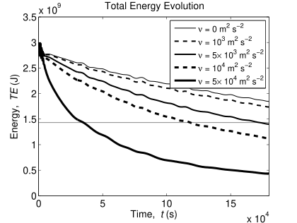
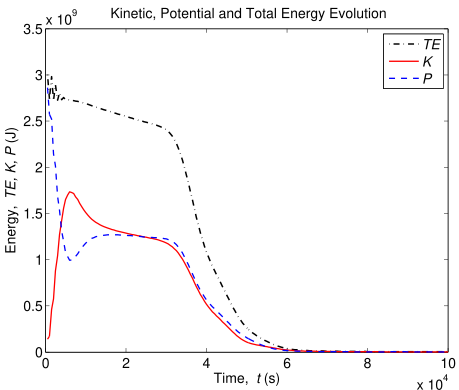
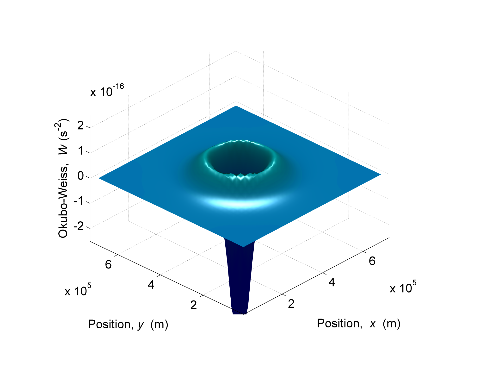

# SWAM Advanced Analysis and Conclusions

[◀ Back to Table of Contents](README.md)

### Energy Decay Study

In order to answer the last question of the previous section, a study with the same model configuration described in the table was undertaken, and several runs were made, each with different viscosities. The energy decay is expected to increase with physical viscosity, however, both physical and numerical viscosity coexist. Numerical viscosity is caused by advection, and since the advective part of the momentum equations remain unchanged by the varying viscosity, the numerical viscosity is expected to have exactly the same influence on the energy decay in the different runs. The figure below displays the results for different viscosities, $\nu$, ranging from $0$ to $5 \times 10^4$ m$^2$ s$^{-1}$.

Though this figure confirms the fact that energy decay increases with viscosity, it actually yields little added value on *how* does energy decays with viscosity. Thus a different approach is needed. A technique often used among particle physicists that need to study the rate of decay of unstable atom isotopes is to look at the half-life, $\tau_{1/2}$, of the particles. The half-life is the time duration for a physical quantity to decay half of its original value. In this case-study, its the time duration that the system takes to dissipate half of its initial total energy. The figure below shows a plot of the $TE$ half-life of the system for different viscosities. 

The plot shows three regions, the low viscosity region for $0 < \nu < 2 \times 10^2$ m$^{2}$ s$^{-1}$, the transition region for $2 \times 10^2 < \nu < 2 \times 10^3$ m$^{2}$ s$^{-1}$, and the high viscosity region for $2 \times 10^3 < \nu < 10^5$ m$^{2}$ s$^{-1}$. For viscosities higher than $10^5$ m$^{2}$ s$^{-1}$ the system reaches the limits of its numerical stability. 

In the low viscosity region there is no dependence of the $TE$ half-life with viscosity, showing a half-life of $3 \times 10^5$ s. This is probably due to numerical viscosity which prevails over the physical viscosity. The transition region shows a balance between the numerical viscosity and the physical viscosity whereas in the high viscosity region, the $TE$ half-life is dominated by physical viscosity, displaying a linear dependence. Therefore, the system can be studied with the aid of numerical experimentation for low Reynolds number, which corresponds to the high viscosity region. 

Since numerical viscosity is present in every numerical modeling experiment, the $TE$ half-life dependence with viscosity is a very useful tool to quantify the behaviour of any system as regards its energy dissipation. Furthermore, it allows to determine the range of viscosities where energy dissipation is dominated by physical viscosity. Finally, it allows to estimate what is the effective viscosity equivalent to the numerical viscosity. In this case, the numerical viscosity has an effective viscosity of about $200$ m$^2$ s$^{-1}$, as indicated by the figure.

Although the half-life figure proposes an experimental technique to determine the viscosity equivalent to numerical viscosity, in practice, depending on the modelled system, it can be lengthy to make all the required runs. Thus it would be interesting to find an analytical method that would estimate the range of viscosities corresponding to the transition region in the figure. Analyzing schematically the numerical scheme for advection and diffusion in the momentum scheme equation (face-centred), the main terms in the $x$-direction yield:

$$\left(\frac{U\,\Delta t}{2\,\Delta x} + \frac{\nu\,\Delta t}{\Delta x^2} \right)\,u_{i+1}
+ 2 \, \frac{\nu\,\Delta t}{\Delta x^2}\,u_i
+ \left( -\frac{U\,\Delta t}{2\,\Delta x} + \frac{\nu\,\Delta t}{\Delta x^2} \right)\,u_{i-1}$$

where $U$ is the characteristic velocity. Viscous diffusion is due to the $\frac{\nu\,\Delta t}{\Delta x^2}$ term while advection and numerical diffusion is due to the $\frac{U\,\Delta t}{2\,\Delta x}$ term. Thus, to ensure that viscous diffusion dominates the numerical one is equivalent to ensure that:

$$\frac{U\,\Delta t}{2\,\Delta x} \ll \frac{\nu\,\Delta t}{\Delta x^2}$$

which is equivalent to consider a very small numerical Reynolds number (or numerical Péclet number) as seen in:

$$\frac{U\,\Delta x}{2\,\nu} \ll 1$$

Using the parameters in the model setup defined in the table, we get:

$$\nu \gg 50 \; \text{m}^2 \text{s}^{-1}$$

which means that viscosities around $50$ m$^2$ s$^{-1}$ are well within the low viscosity region, viscosities around $500$ m$^2$ s$^{-1}$ should be around the transition region, and viscosities around $5000$ m$^2$ s$^{-1}$ should be well within the high viscosity region. The numerical experimentation results shown in the half-life figure corroborates the hypothesis that physical viscosity is dominant in numerical models when the condition seen in the numerical Péclet number equation is satisfied. 

The figure displays a low viscosity region where numerical diffusion is dominant, for $\nu =50$ m$^2$ s$^{-1}$, a transition region, for $\nu=500$ m$^2$ s$^{-1}$, and a high viscosity region where physical viscosity is dominant, for $\nu=5000$ m$^2$ s$^{-1}$. The interesting and counter-intuitive aspect about the condition in the equation is that it has not a dependency on the time-step. If the criterion in the equation is not met then energy dissipation is driven by numerical diffusion alone, which is undesired for a proper study on energy cascade or turbulence in general.

The figure below displays the time evolution of $\frac{TE}{TE_0}(t^\star)$ for $\nu = 5000$ m$^2$ s$^{-1}$ in adimensional units of $T_\sigma$ for several values of $\sigma$. The multiple plots show a perfect overlap, indicating that the linearized adimensional equation is plausible. Furthermore, the adimensional time unit of $T_\sigma$, given in the characteristic dissipation time equation, corresponds roughly to the energy half-life of the system, which is exactly what a characteristic energy dissipation time is expected to yield.

Finally, and to finish the study on the energy dissipation, the figure below shows the mechanical energy and its sum with the turbulent kinetic energy, calculated accordingly with the proposed model in the turbulent kinetic energy equations. The expected result:

$$TE + TKE = TE_0$$

is nearly obtained. The slight linear loss can be due to the impact of numerical diffusion and to a consistent cumulative error while averaging the crossed derivative terms in the epsilon dissipation equation. Hence the energy analytical diagnostic models deduced from the simple geometry and symmetry provided by the gaussian bump show good agreement. This seems to show that the gaussian bump is a very interesting academic test-case to verify the correct implementation of numerical schemes of the shallow waters equations.

### Radiation Boundary Condition

The former set of experiences was achieved with closed walls at the boundaries. The following set of experiences aims at validating and assessing the performance of the simple gravity wave explicit (GWE) radiation condition for the water elevation and for the tangential velocity, and the Flather (1976) (FLA) radiation condition for the normal velocity. The table below contains the new configuration of the numerical experiment.

| Parameter | Value |
|-----------|-------|
| $H$ | 10 m |
| $h_0$ | 1 cm |
| $\sigma_x$ | $6 \times 10^4$ m |
| $\nu$ | $5 \times 3$ m$^2$ s$^{-1}$ |
| $M \times N$ | $37 \times 37$ |
| Duration | $1.8 \times 10^5$ s |
| $dx$ | $2 \times 10^4$ m |
| $dt$ | 500 s |
| $TE_0$ | $2.86 \times 10^9$ J |
| $U_0$ | $\sim 5 \times 10^{-3}$ m s$^{-1}$ |
| $c$ | $\sim 10$ m s$^{-1}$ |
| $\text{Fr}$ | $\sim 5 \times 10^{-4}$ |
| Boundary | GWE+FLA |
| Volume | $1.13 \times 10^8$ m$^3$ |

### Geostrophic Equilibrium

The steady-state solution where the Coriolis force balances the pressure gradient in a domain writes:

$$
\begin{cases}
     f \, v_g = g\,\frac{\partial \eta_g }{\partial x} \\
     f \, u_g = - g\,\frac{\partial \eta_g }{\partial y}
\end{cases}
$$

By applying the first derivatives along $y$ and $x$ to the first and second differential equation respectively, and assuming that the Coriolis frequency is constant throughout the domain, the result yields:

$$\begin{align}
\begin{cases}
\frac{\partial v_g}{\partial x} = \frac{g}{f}\frac{\partial^2 \eta_g }{\partial x^2} \\
\frac{\partial u_g}{\partial y} = - \frac{g}{f}\frac{\partial \eta_g }{\partial y^2}
\end{cases}
\Rightarrow
\frac{\partial^2 \eta_g }{\partial x^2} + \frac{\partial^2 \eta_g }{\partial y^2} = \frac{f}{g}\left( \frac{\partial v_g}{\partial x} - \frac{\partial u_g}{\partial y} \right) = \frac{f}{g} \zeta_g
\end{align}$$

$\zeta_g$ is the vertical component of relative vorticity in geostrophical equilibrium. Remembering the conservation of potential vorticity, we get:

$$\begin{align}
Q &= \frac{\zeta + f}{H} = const \\
\Rightarrow \frac{\zeta_g+f}{H_g} &= \frac{\zeta_0+f}{H_0} \\
\Rightarrow \zeta_g &= \frac{H_g}{H_0} \left( \zeta_0 + f \right) - f = \left(\frac{H_g}{H_0} - 1 \right) f + \zeta_0 \\
\Leftrightarrow \zeta_g &= \frac{\eta_g - \eta_0}{H_0}f + \zeta_0
\end{align}$$

The $g,\;0$ subscript notation means, respectively, geostrophical equilibrium and initial instant; furthermore, $H \equiv d + \eta$, where $d$ is the depth relative to a reference geopotential and $\eta$ is the surface elevation from a reference geopotential. Inserting the property found in the equation above into the partial derivatives equation yields:

$$\begin{align}
\frac{\partial^2 \eta_g}{\partial x^2} + \frac{\partial^2 \eta_g}{\partial y^2} &= \frac{f^2}{g\,H_0} (\eta_g - \eta_0) + \frac{f}{g}\zeta_0 \\
&= \frac{f^2}{c^2} (\eta_g - \eta_0) + \frac{f}{g}\zeta_0
\end{align}$$

where $c_0^2 \equiv g\,H_0$ and where it is considered that $\eta \ll d$, so that $c_0 \approx c$. When the solution has radial symmetry and the initial vorticity is null, the equation writes:

$$\frac{\partial^2 \eta}{\partial r^2} = \frac{f^2}{c^2} \left(\eta_g - \eta_0 \right)$$

which is a non-homogeneous second-order linear differential equation, where $r^2 \equiv x^2 + y^2$. Depending on the value of $\eta_0$, an analytical solution of this equation can be easily found, in perfect analogy with the example shown in Gill (1982).

The table below indicates the configuration of the experiment consisting in the release of a gaussian bump elevation in a rotating fluid (with the Earth Coriolis rotation frequency equal to $43^o$ N).

| Parameter | Value |
|-----------|-------|
| $H$ | 10 m |
| $h_0$ | 1 cm |
| $\sigma_x$ | $6 \times 10^4$ m |
| $\nu$ | $5 \times 3$ m$^2$ s$^{-1}$ |
| $M \times N$ | $37 \times 37$ |
| Duration | $1.8 \times 10^5$ s |
| $dx$ | $2 \times 10^4$ m |
| $dt$ | 500 s |
| $TE_0$ | $2.86 \times 10^9$ J |
| $U_0$ | $\sim 5 \times 10^{-3}$ m s$^{-1}$ |
| $c$ | $\sim 10$ m s$^{-1}$ |
| $\text{Fr}$ | $\sim 5 \times 10^{-4}$ |
| Boundary | GWE+FLA |
| Volume | $1.13 \times 10^8$ m$^3$ |

The figure below shows the total volume evolution with time of the experiment described in the table. This time, the final volume gains a small increase relative to its original value. This is theoretically deducible with the principle of conservation of the initial potential vorticity, $Q$, given by, according to Gill (1982, p. 192):

$$Q(t) = \frac{\zeta - f \, \frac{\eta}{H}}{H}$$

Finally, contrarily to the non-rotating case, after the gravity wave is radiated out of the domain, a significant amount of energy is retained within the geostrophic balance as seen in the figure below, about a third of the initial $TE$, half of which is composed by potential energy coming from the elevation solution at rest and another half which is composed by the geostrophic flow velocity field.

The Okubo-Weiss parameter was already applied to identify vortex structures from satellite SST and SSH shots over the Mediterranean (Isern-Fontanet et al., 2004). In this case study there is a central barotropic eddy in the centre of the domain. The figure below shows, as described by Isern-Fontanet et al. (2004), the center of the eddy clearly dominated by enstrophy, as is seen by the negative values of OW at the centre of the domain, and near the edges of the eddy, a strain stress dominated field, where most of the TKE production occurs.

The sequence of panels in the figure below illustrate the geostrophic adjustment of the gaussian bump after release in three stages: 
a) before the gravity wave front arrives at the boundary
b) during the boundary crossing of the gravity wave 
c) after the gravity wave front passed and a geostrophic balance remains

![Adjustment of a gaussian elevation in a rotating domain. Left panels display the gravity wave elevation and right panels display the flow velocity field. a) The top panels show the transient state of the system shortly after the initial gaussian elevation was released and before the gravity wave front arrive at the boundaries. b) The middle panels show the gravity wave front crossing the boundaries and the instauration of the central eddy evolving towards geostrophic equilibrium. c) The bottom panels show the geostrophic equilibrium, well after the gravity wave front was radiated at the boundaries.](figs/radiate-coriolis-eta-transient1-sam2p.svg)

### Applying the Okubo-Weiss Scalar to Assess the Open-Boundary Condition

Besides being an effective tool at identifying eddies, the Okubo-Weiss scalar is fundamentally an objective tool capable of identifying hyperbolic regions of the flow, (dominated by the strain rate tensor, yielding positive values), from elliptic regions of the flow (dominated by vorticity, yielding negative values). The theory goes that solid boundaries (regions of null-flux) influence locally towards an elliptic flow (Weiss, 1981). The idea is check whether the gravity wave radiative boundary condition influence what otherwise should have been a perfectly hyperbolic flow (i.e. OW $< 0$). 

A numerical experiment was setup with two models releasing exactly the same gaussian elevation at their centre. One of the models has the boundaries farther away, thus doubling its grid-cells per dimension. The duration of $80000$ s was chosen so that the gravity wave front passed through the smaller domain boundaries but barely reached the larger domain boundaries. The idea is to compare the Okubo-Weiss parameter in the common region of both domains at the same instant of $80000$ s. Differences in the nature of the flow should be attributed to the existence of a boundary. Different implementations of boundary conditions should yield differences as well. The goal is to find the best open boundary radiative scheme, thus the goal is to find the boundary condition which yields the most similar OW map with the one from the large domain near the boundaries.

| Parameter | Value |
|-----------|-------|
| $H$ | 10 m |
| $h_0$ | 1 cm |
| $\sigma_x$ | $6 \times 10^4$ m |
| $\nu$ | $5 \times 10^3$ m$^2$ s$^{-1}$ |
| $M \times N$ small model | $37 \times 37$ |
| $M \times N$ large model | $73 \times 73$ |
| Duration | $8 \times 10^4$ s |
| $dx$ | $2 \times 10^4$ m |
| $dt$ | 500 s |
| $TE_0$ | $2.86 \times 10^9$ J |
| $U_0$ | $\sim 5 \times 10^{-3}$ m s$^{-1}$ |
| $c$ | $\sim 10$ m s$^{-1}$ |
| $\text{Fr}$ | $\sim 5 \times 10^{-4}$ |
| Boundary | GWE |
| Volume | $1.13 \times 10^8$ m$^3$ |

The contour plot in the figure below, on the left panel, displays a radial and all positive Okubo-Weiss scalar field with an order of magnitude of about $\sim 10^{-21}$ for the large domain. It means that the flow is purely hyperbolic and has little intensity when compared to the velocity in the wake of the wave front. On the right panel, the OW contour plot in the smaller domain shows an elliptic boundary layer, due to the partial reflection of the gravity wave. The hyperbolic flow on the domain interior reaches $\sim 10^{-19}$, i.e. two orders of magnitude above the flow on the interior of the large domain. This means that the hyperbolic flow of the gravity waves was partially reflected back into the interior of the domain. Objectively, a better radiative boundary condition would minimize or even remove the elliptic boundary layer present in the small domain shown by the Okubo-Weiss parameter.

## Conclusions

Here lies the shallow-water equations numerical model as described in Kantha and Clayson (2000) with the same numerical scheme. It currently only has the Dirichelet boundary conditions and the gravity wave explicit radiation scheme added of a null-gradient or Flather for the normal velocity. This means that, in the former case, all surface waves bounce back at the boundary and and give rise to a cascade of multiple linear superpositions leading to a path of unavoidable numerical instability. In the latter case, the solution radiates any level perturbation (gravitic waves) at the open boundaries (Orlanski, 1976; Shchepetkin and McWilliams, 2003). 

It is important to note that the geometric considerations of the gaussian bump elevation at the instant of release were crucial in order to estimate matching predictions of energy partitioning and production of TKE. In particular, it was found that the relative production rate of TKE varies with viscosity and $\sigma$ alone, and is independent of the Froude number associated with the gaussian gravity wave.

Further work involves implementing relaxing conditions at the boundaries, variable coriolis force, cyclic boundary conditions. Ultimately, using a sponge layer near the boundaries is considered (Martinsen and Engedahl, 1987; Shchepetkin and McWilliams, 2003; Pietrzak et al., 2002), as well as developing the recent works of Blayo and Debreu (2005) with incoming characteristics and of Lavelle and Thacker (2008) with the PML conditions.

## References

- Arakawa, A. (1966). Computational design for long-term numerical integration of the equations of fluid motion: Two-dimensional incompressible flow. Part I. Journal of Computational Physics, 1(1), 119-143.
- Asselin, R. (1972). Frequency filter for time integrations. Monthly Weather Review, 100(6), 487-490.
- Beckmann, A., & Haidvogel, D. B. (1993). Numerical simulation of flow around a tall isolated seamount. Part I: Problem formulation and model accuracy. Journal of Physical Oceanography, 23(8), 1736-1753.
- Blayo, E., & Debreu, L. (2005). Revisiting open boundary conditions from the point of view of characteristic variables. Ocean modelling, 9(3), 231-252.
- Burchard, H. (2002). Applied turbulence modelling in marine waters. Springer Science & Business Media.
- Courant, R., Friedrichs, K., & Lewy, H. (1959). On the partial difference equations of mathematical physics. IBM Journal of Research and Development, 3(3), 215-234.
- Flather, R. A. (1976). A tidal model of the northwest European continental shelf. Mémoires de la Société Royale des Sciences de Liège, 10(6), 141-164.
- Gill, A. E. (1982). Atmosphere-ocean dynamics (Vol. 30). Academic press.
- Herzfeld, M. (2008). The role of numerical implementation on open boundary behaviour in limited area ocean models. Ocean Modelling, 27(1-2), 18-32.
- Isern-Fontanet, J., Font, J., García-Ladona, E., Emelianov, M., Millot, C., & Taupier-Letage, I. (2004). Spatial structure of anticyclonic eddies in the Algerian basin (Mediterranean Sea) analyzed using the Okubo–Weiss parameter. Deep Sea Research Part II: Topical Studies in Oceanography, 51(25-26), 3009-3028.
- Kantha, L. H., & Clayson, C. A. (2000). Numerical models of oceans and oceanic processes (Vol. 66). Academic press.
- Kundu, P. K., & Cohen, I. M. (2002). Fluid mechanics. Elsevier Academic Press, New York.
- Lavelle, J. W., & Thacker, W. C. (2008). A pretty good sponge: Dealing with open boundaries in limited-area ocean models. Ocean Modelling, 20(3), 270-292.
- Leitao, P. (2003). Modelo de circulação na região do cabo de Sines (in Portuguese). PhD thesis, Technical University of Lisbon.
- Marsaleix, P., Auclair, F., & Estournel, C. (2009). Low-order pressure gradient schemes in sigma coordinate models: The seamount test revisited. Ocean Modelling, 30(2-3), 169-177.
- Martinsen, E. A., & Engedahl, H. (1987). Implementation and testing of a lateral boundary scheme as an open boundary condition in a barotropic ocean model. Coastal engineering, 11(5-6), 603-627.
- Orlanski, I. (1976). A simple boundary condition for unbounded hyperbolic flows. Journal of computational physics, 21(3), 251-269.
- Pedlosky, J. (1987). Geophysical fluid dynamics. Springer, New York.
- Pietrzak, J., Jakobson, J. B., Burchard, H., Vested, H. J., & Petersen, O. (2002). A three-dimensional hydrostatic model for coastal and ocean modelling using a generalised topography following co-ordinate system. Ocean Modelling, 4(2), 173-205.
- Shchepetkin, A. F., & McWilliams, J. C. (2003). A method for computing horizontal pressure-gradient force in an oceanic model with a nonaligned vertical coordinate. Journal of Geophysical Research: Oceans, 108(C3).
- Weiss, J. (1981). The dynamics of enstrophy transfer in two-dimensional hydrodynamics. Technical Report LJI-TN-121, La Jolla Inst., La Jolla, California.
